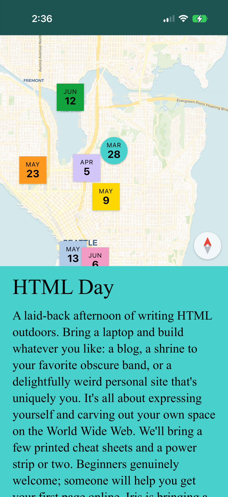

# /events 🐞

community-scale infrastructure for local meetups and workshops.  

<h3 align="center">
	
	  
	<a href="https://hunterirving.github.io/events">demo</a>  
</h3>

## features
- auto-generated printable flyers
- RSVP by E-mail
- installable as a [Progressive Web App](https://hunterirving.github.io/web_workshop/pages/pwa) for offline use

## usage 🪲
add an `events.json` file to `resources/` to override the events from `demo.json`.
- upcoming events will be displayed on the map.
- if no upcoming events are present, past events will be shown instead.

## license

this project is licensed under the <a href="LICENSE">GNU General Public License v3.0</a>.

the following third-party resources are included in this repo:

- **[Leaflet](https://leafletjs.com)** 1.9.4, <a href="resources/leaflet/LICENSE-leaflet">BSD 2-Clause License</a>
- **[Leaflet.TileLayer.NoGap](https://github.com/Leaflet/Leaflet.TileLayer.NoGap)** (modified), [Beerware License](resources/leaflet/LICENSE-nogap)

<h3 align="center">🐛  </h3>